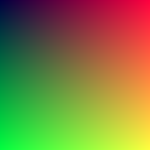

# Learning Rust Part 2: Output an Image

> 📚 Series: [Part 1](https://github.com/lopossumi/Rust-Hello) - [Part 2](https://github.com/lopossumi/Rust-Output-Image) - [Part 3](https://github.com/lopossumi/Rust-Vectors)

In this session our goal is to write an image file with some colored pixels. It seems that we need to be able to do at least the following:

* Loop over some pixels in an x-y coordinate system
* Assing some color to each pixel
* Write all this information to a file in some format.

In the book everything is written in PPM format to stdout and piped to a text file. It is a good starting point, but let's set some additional goals:

* Write the information to an image buffer instead of stdout
* Write the buffer to a PNG file
    * To achieve this, we should import some image library using the package manager. 


## Writing to stdout

The ```hello``` program already printed stuff to stdout using the ```println!``` macro, but we can also output variable values:
```rust
fn main() {
    let name = "J. Random User";
    println!("Hello, {}!", name);
}
```
Output:

```
Hello, J. Random User!
```

## Loops

The Rust language contains three ways of iterating: ```loop```, ```while``` and ```for```. Note that according to the docs, ```loop``` should be used instead of the ```while true``` expression common in other languages.

The ```for``` loop is most suitable for our purpose, as we know the width and height of the image we are trying to produce. The syntax is a bit different from C-style ```for``` loops, and looks more akin to a ```foreach``` statement in C#:
```rust
fn main() {
    for x in 0..5 {
        println!("{}", x);
    }
}
```

Running the program we get the following output:

```powershell
PS D:\RustProjects\output-image> cargo run
0
1
2
3
4
```

> 💡 Note: If you want to include the last number, the expression should be written as ```for x in 1..=5```.

## PPM Image Format

Now we have all the pieces to translate the C++ example code to Rust and output our first image file. First, the header part:

```rust
fn main() {
    const IMAGE_WIDTH: i32 = 256;
    const IMAGE_HEIGHT: i32 = 256;

    println!("P3\n{} {}\n255", IMAGE_WIDTH, IMAGE_HEIGHT);

    // TODO: Add the for loops
}
```
Then, the ```for``` loops. In the example the outer loop iterates backwards, so we need to add the ```.rev()``` for the range:
```rust
    for j in (0..IMAGE_HEIGHT).rev() {
        for i in 0..IMAGE_WIDTH {
            // TODO: Output pixels
        }
    }
```
And finally the pixel color values. Here we need to do a bit more typecasting than with the C++ code, as Rust doesn't allow division between ```double``` and ```integer``` values. The final program looks like this:
```rust
fn main() {
    const IMAGE_WIDTH: i32 = 256;
    const IMAGE_HEIGHT: i32 = 256;

    println!("P3\n{} {}\n255", IMAGE_WIDTH, IMAGE_HEIGHT);

    for j in (0..IMAGE_HEIGHT).rev() {
        for i in 0..IMAGE_WIDTH {
            let r = i as f64 / (IMAGE_WIDTH-1) as f64;
            let g = j as f64 / (IMAGE_HEIGHT-1) as f64;
            let b = 0.25;

            let ir = (255.99 * r) as u8;
            let ig = (255.99 * g) as u8;
            let ib = (255.99 * b) as u8;

            println!("{} {} {}", ir, ig, ib);
        }
    }
}
```
Redirecting the output to a file, we get a PPM image file weighing in at 1.46 MB. The file can viewed e.g. with an [online viewer](http://cs.rhodes.edu/welshc/COMP141_F16/ppmReader.html).
```powershell
PS D:\RustProjects\output-image> cargo run > image.ppm
```


> 💡 Note: The default types are ```i32``` for integers and ```f64``` for floats.

## Error output
To track a long running render, let's add progress reporting. Similar to the ```println!``` macro, Rust provides a ```eprintln!``` mactro which directs the output to the error output stream.

```rust
    ...
    for j in (0..IMAGE_HEIGHT).rev() {
        eprintln!("Scanlines remaining: {}", j);
        for i in 0..IMAGE_WIDTH {
            ...
```
Now we a are done with chapter 2. However, there's still room for improvement before moving on to the next chapter.

## PNG output

PPM is a pretty awful image format. Instead it would be cool to store the output directly as a PNG file. The Rust package registry crates.io contains a lot of packages for image processing, so I'll select the most obvious one called [image](https://crates.io/crates/image).

Add the package with its version to the ```Cargo.toml``` file:
```toml
[dependencies]
image = "0.23.7"
```

Then, import the package with ```use image```.

```rust
use image;

fn main() {
    // These constants must be re-typed as u32 for the image buffer.
    const IMAGE_WIDTH: u32 = 256;
    const IMAGE_HEIGHT: u32 = 256;

    // The buffer variable must be marked mutable (mut), as we are going to alter the values 
    // in our for loops.
    let mut buffer: image::RgbImage = image::ImageBuffer::new(IMAGE_WIDTH, IMAGE_HEIGHT);
```
> 💡 Note: Older code examples often mention ```extern crate```, but in Rust 2018 it should no longer be required.

### Prettier imports

Writing the module name all the time (e.g. ```image::RgbImage```) gets old real quick. There is a convenient way to shorten this by modifying the ```use``` expression a bit:
```rust
use image::{RgbImage, ImageBuffer, Rgb};

fn main() {

    const IMAGE_WIDTH: u32 = 256;
    const IMAGE_HEIGHT: u32 = 256;

    let mut buffer: RgbImage = ImageBuffer::new(IMAGE_WIDTH, IMAGE_HEIGHT);
```
That's better.

### Final program

Now all we need to do is iterate over all the pixels in the image buffer, set the color value as before, and save to a file:
```rust
use image::{RgbImage, ImageBuffer, Rgb};

fn main() {

    const IMAGE_WIDTH: u32 = 256;
    const IMAGE_HEIGHT: u32 = 256;

    let mut buffer: RgbImage = ImageBuffer::new(IMAGE_WIDTH, IMAGE_HEIGHT);

    for (x, z, y, pixel) in buffer.enumerate_pixels_mut(){
        let r = x as f64 / (IMAGE_WIDTH-1) as f64;
        let g = y as f64 / (IMAGE_HEIGHT-1) as f64;
        let b = 0.25;

        let ir = (255.999 * r) as u8;
        let ig = (255.999 * g) as u8;
        let ib = (255.999 * b) as u8;

        *pixel = Rgb([ir, ig, ib]);
    }

    buffer.save("image.png").unwrap();
}
```
There's a lot of stuff to process here.
* First, we're using a ```Tuple``` with 3 elements in the ```for``` loop (x-coordinate, y-coordinate and reference to the pixel itself). Now this seems really useful! Who said we were dealing with a low level language?
* Then, we *dereference* the value of ```pixel``` and assign a new ```Rgb struct``` to it.
* Finally, we ```unwrap()``` the result of the ```save("filename")``` operation. If the save operation would fail, the program would panic in a not-so-pretty way.

#### Error handling

Unwrapping should be OK if the result is never an error, but writing to a file can always fail. Let's write either "Done" or our own error message depending on the result:
```rust
    match buffer.save("image.png") {
        Err(e) => eprintln!("Error writing file: {}", e),
        Ok(()) => println!("Done."),
    };
```

And now we are finally done. In the next session we'll create some vectors.